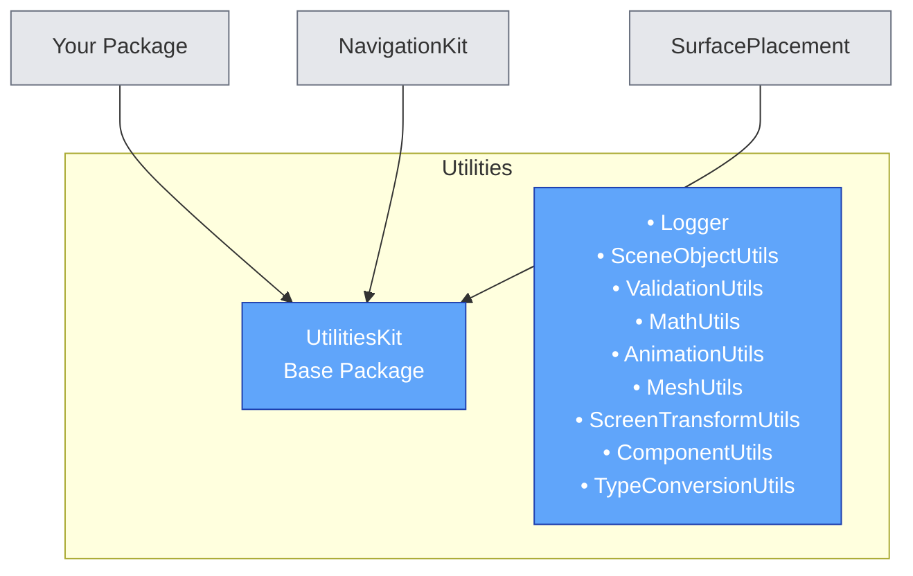

# UtilitiesKit

[]() []()

Comprehensive utility library providing common functions for scene object management, validation, math operations, animations, mesh generation, UI calculations, and type conversions.

## Overview

UtilitiesKit centralizes common utility functions used across Spectacles packages, eliminating code duplication and providing a single source of truth for frequently-used operations. With 9 specialized utility classes, it covers everything from scene hierarchy traversal to geographical calculations.

### Key Benefits

- **Zero Dependencies**: Base package with no external dependencies
- **TypeScript-First**: Fully typed for excellent IDE support
- **Battle-Tested**: Extracted from production packages
- **Comprehensive**: 50+ utility functions covering common use cases
- **Well-Documented**: JSDoc comments on all methods

> **NOTE:** This package is designed to be a dependency for other packages. It does not provide visual components, only utility functions.

## Design Guidelines

Designing Lenses for Spectacles offers all-new possibilities for immersive AR experiences. [View Design Guidelines](https://docs.snap.com/spectacles)

## Prerequisites

- **Lens Studio**: v5.15.0+
- **Spectacles OS Version**: v5.64+
- **Spectacles App iOS**: v0.64+
- **Spectacles App Android**: v0.64+

To update your Spectacles device and mobile app, please refer to this [guide](https://support.spectacles.com).

You can download the latest version of Lens Studio from [here](https://ar.snap.com/download).

## Getting Started

### Installation

1. Add UtilitiesKit to your project's `package_dependencies.json`:

```json
{
  "dependencies": [
    {
      "name": "UtilitiesKit",
      "version": "1.0.0"
    }
  ]
}
```

2. Import utilities in your TypeScript scripts:

```typescript
import { Logger } from "UtilitiesKit.lspkg/Scripts/Utils/Logger";
import { SceneObjectUtils } from "UtilitiesKit.lspkg/Scripts/Utils/SceneObjectUtils";
import { ValidationUtils } from "UtilitiesKit.lspkg/Scripts/Utils/ValidationUtils";
import { MathUtils } from "UtilitiesKit.lspkg/Scripts/Utils/MathUtils";
```

## Utility Classes

### 1. Logger

Centralized logging utility with colored output and debug modes.

**Key Methods:**
- `info(message)` - Log informational messages
- `debug(message)` - Log debug messages (if enabled)
- `warn(message)` - Log warnings
- `error(message)` - Log errors
- `success(message)` - Log success messages
- `header(message)` - Log formatted headers
- `separator(char, length)` - Log visual separators

**Example:**
```typescript
import { Logger } from "UtilitiesKit.lspkg/Scripts/Utils/Logger";

const logger = new Logger("MyScript", true, true);
logger.info("Script initialized");
logger.warn("Missing optional parameter");
logger.error("Failed to load resource");
```

---

### 2. SceneObjectUtils

Scene hierarchy traversal and component finding utilities.

**Key Methods:**
- `forEachSceneObjectInSubHierarchy(sceneObject, fn, includeSelf)` - Traverse hierarchy
- `getSceneRoot(sceneObject)` - Get root scene object
- `findComponentInHierarchy<T>(root, typeName)` - Find component recursively
- `getOrCreateComponent<T>(sceneObject, componentTypeName)` - Get or create component
- `findSceneObjectByNameVariations(root, targetName, customVariations)` - Find with name variations
- `findScriptComponent(sceneObject, propertyName)` - Find script by property

**Example:**
```typescript
import { SceneObjectUtils } from "UtilitiesKit.lspkg/Scripts/Utils/SceneObjectUtils";

// Get or create a component
const collider = SceneObjectUtils.getOrCreateComponent<ColliderComponent>(
  myObject,
  "ColliderComponent"
);

// Find component in hierarchy
const controller = SceneObjectUtils.findComponentInHierarchy<MyController>(
  rootObject,
  "MyController"
);

// Traverse hierarchy
SceneObjectUtils.forEachSceneObjectInSubHierarchy(rootObject, (obj) => {
  print(`Found object: ${obj.name}`);
});
```

---

### 3. ValidationUtils

Input validation, null checks, and assertion utilities.

**Key Methods:**
- `assertNotNull<T>(value, message)` - Assert value is not null
- `assert(condition, message)` - Assert condition is true
- `ifNotNull<T, R>(value, callback)` - Execute callback if not null
- `ifExists<T, R>(ref, callback)` - Execute callback if exists
- `validateInputs(inputs, requiredKeys)` - Validate required inputs
- `isNull(value)` - Check if null/undefined
- `isNotNull(value)` - Check if not null/undefined

**Example:**
```typescript
import { ValidationUtils } from "UtilitiesKit.lspkg/Scripts/Utils/ValidationUtils";

// Assert not null
const target = ValidationUtils.assertNotNull(
  this.targetObject,
  "Target object must be assigned"
);

// Validate inputs
ValidationUtils.validateInputs(
  {prefab: this.prefab, parent: this.parent},
  ["prefab", "parent"]
);

// Conditional execution
ValidationUtils.ifNotNull(this.optionalCallback, (callback) => {
  callback();
});
```

---

### 4. MathUtils

Mathematical operations including vector, quaternion, and geographical calculations.

**Key Methods:**
- `lerp(start, end, scalar)` - Linear interpolation
- `mod(n, m)` - Modulo operation
- `normalizeAngle(angle)` - Normalize angle to [-π, π]
- `quaternionToRoll(quaternion)` - Convert quaternion to roll
- `quaternionToPitch(quaternion)` - Convert quaternion to pitch
- `quaternionToEuler(quaternion)` - Convert quaternion to Euler angles
- `interpolateRotation(startRotation, endRotation, peakVelocity)` - Quaternion slerp
- `easeOutElastic(x)` - Elastic easing function
- `haversineDistance(location1, location2)` - Distance between coordinates
- `calculateBearing(start, end)` - Bearing between coordinates

**Constants:**
- `EPSILON` - Small value for floating-point comparisons (0.000001)
- `DegToRad` - Degrees to radians conversion

**Example:**
```typescript
import { MathUtils, GeoCoordinate } from "UtilitiesKit.lspkg/Scripts/Utils/MathUtils";

// Linear interpolation
const interpolated = MathUtils.lerp(0, 100, 0.5); // Returns 50

// Quaternion to Euler
const euler = MathUtils.quaternionToEuler(myQuaternion);
print(`Pitch: ${euler.x}, Yaw: ${euler.y}, Roll: ${euler.z}`);

// Geographical distance
const loc1: GeoCoordinate = {longitude: -122.4194, latitude: 37.7749, altitude: 0};
const loc2: GeoCoordinate = {longitude: -118.2437, latitude: 34.0522, altitude: 0};
const distance = MathUtils.haversineDistance(loc1, loc2);
print(`Distance: ${distance} meters`);
```

---

### 5. AnimationUtils

Animation helpers, tweening, and easing utilities.

**Key Methods:**
- `makeTween(callback, duration)` - Create cancelable frame-based tween
- `pingPong(min, max, t)` - Ping-pong oscillation
- `animateScale(sceneObject, startScale, endScale, duration, easing, onComplete)` - Animate scale
- `animateVisualFeedback(sceneObject, fadeIn, duration, onComplete)` - Fade in/out animation
- `getEasingId(name)` - Get easing ID from name
- `getEasingName(id)` - Get easing name from ID
- `getAllEasings()` - Get all available easings

**Example:**
```typescript
import { AnimationUtils } from "UtilitiesKit.lspkg/Scripts/Utils/AnimationUtils";

// Create a tween
const cancel = AnimationUtils.makeTween((t) => {
  const scale = MathUtils.lerp(1, 2, t);
  myObject.getTransform().setLocalScale(new vec3(scale, scale, scale));
}, 1.0);

// Animate scale with cancelation
const cancelSet = AnimationUtils.animateScale(
  myObject,
  vec3.one(),
  new vec3(1.5, 1.5, 1.5),
  0.5,
  "ease-out-cubic",
  () => print("Animation complete")
);

// Fade in visual
AnimationUtils.animateVisualFeedback(myObject, true, 0.5);
```

---

### 6. MeshUtils

Render mesh generation for 2D shapes (circles, lines).

**Key Methods:**
- `makeCircle2DMesh(position, radius)` - Create circle mesh
- `makeCircle2DIndicesVerticesPair(position, radius, segments, indicesOffset)` - Generate circle geometry
- `makeLineStrip2DMeshWithJoints(positions, thickness)` - Create line strip with rounded joints
- `makeLine2DIndicesVerticesPair(start, end, thickness, indicesOffset)` - Generate line geometry
- `addRenderMeshVisual(sceneObject, mesh, material, renderOrder)` - Add render mesh to scene object

**Example:**
```typescript
import { MeshUtils } from "UtilitiesKit.lspkg/Scripts/Utils/MeshUtils";

// Create a circle mesh
const circleMesh = MeshUtils.makeCircle2DMesh(vec3.zero(), 0.5);
const renderMeshVisual = MeshUtils.addRenderMeshVisual(
  myObject,
  circleMesh,
  myMaterial,
  0
);

// Create a line strip
const positions = [vec3.zero(), new vec3(1, 0, 0), new vec3(1, 1, 0)];
const lineMesh = MeshUtils.makeLineStrip2DMeshWithJoints(positions, 0.1);
```

---

### 7. ScreenTransformUtils

UI dimension calculations, position conversions, and click detection.

**Key Methods:**
- `getScreenTransformPositionsAsArray(screenTransform)` - Get bounding positions
- `wasClicked(screenTransform, screenPoint)` - Check if clicked
- `getScreenTransformWorldWidth(screenTransform)` - Get world width
- `getScreenTransformWorldHeight(screenTransform)` - Get world height
- `getWorldWidthToRelativeToParentWidth(parentScreenTransform, worldWidth)` - Convert to relative width
- `getWorldHeightToRelativeToParentHeight(parentScreenTransform, worldHeight)` - Convert to relative height
- `setScreenTransformRect01(screenTransform, x, y, width, height)` - Set rect with normalized coords
- `compareScreenTransformsPositionsArray(a, b)` - Compare positions

**Example:**
```typescript
import { ScreenTransformUtils } from "UtilitiesKit.lspkg/Scripts/Utils/ScreenTransformUtils";

// Get dimensions
const width = ScreenTransformUtils.getScreenTransformWorldWidth(myScreenTransform);
const height = ScreenTransformUtils.getScreenTransformWorldHeight(myScreenTransform);

// Check if clicked
if (ScreenTransformUtils.wasClicked(myScreenTransform, touchPoint)) {
  print("Screen transform was clicked!");
}

// Set position and size (normalized 0-1)
ScreenTransformUtils.setScreenTransformRect01(
  myScreenTransform,
  0.25, // x: 25% from left
  0.25, // y: 25% from top
  0.5,  // width: 50%
  0.5   // height: 50%
);
```

---

### 8. ComponentUtils

Component search patterns and initialization helpers.

**Key Methods:**
- `findInParents<T>(sceneObject, componentTypeName)` - Find component in parent hierarchy
- `safeInitialize(component)` - Safely initialize component
- `findRootWithComponent(componentTypeName)` - Find root object with component
- `getRootCamera()` - Get main camera
- `getAllComponents<T>(sceneObject, componentTypeName)` - Get all components of type

**Example:**
```typescript
import { ComponentUtils } from "UtilitiesKit.lspkg/Scripts/Utils/ComponentUtils";

// Find component in parents
const scrollWindow = ComponentUtils.findInParents<ScrollWindow>(
  this.getSceneObject(),
  "ScrollWindow"
);

// Get root camera
const camera = ComponentUtils.getRootCamera();

// Safely initialize
const initialized = ComponentUtils.safeInitialize(myComponent);
```

---

### 9. TypeConversionUtils

String parsing, number conversions, and safe type handling.

**Key Methods:**
- `convertToNumber(s)` - Convert string to number (handles commas)
- `safeParseNumber(str, defaultValue)` - Parse number with default
- `safeParseInt(str, defaultValue)` - Parse integer with default
- `toBoolean(value)` - Convert to boolean
- `toString(value, defaultValue)` - Convert to string safely

**Example:**
```typescript
import { TypeConversionUtils } from "UtilitiesKit.lspkg/Scripts/Utils/TypeConversionUtils";

// Parse number with comma separator
const number = TypeConversionUtils.convertToNumber("3,14"); // Returns 3.14

// Safe parsing with default
const value = TypeConversionUtils.safeParseNumber(userInput, 0);

// Boolean conversion
const enabled = TypeConversionUtils.toBoolean("true"); // Returns true
```

---

## Common Usage Patterns

### Pattern 1: Component Setup with Validation

```typescript
import { ValidationUtils } from "UtilitiesKit.lspkg/Scripts/Utils/ValidationUtils";
import { SceneObjectUtils } from "UtilitiesKit.lspkg/Scripts/Utils/SceneObjectUtils";

onAwake() {
  // Validate inputs
  ValidationUtils.validateInputs(
    {targetObject: this.targetObject, prefab: this.prefab},
    ["targetObject", "prefab"]
  );

  // Get or create components
  this.collider = SceneObjectUtils.getOrCreateComponent<ColliderComponent>(
    this.targetObject,
    "ColliderComponent"
  );
}
```

### Pattern 2: Animation with Tween

```typescript
import { AnimationUtils } from "UtilitiesKit.lspkg/Scripts/Utils/AnimationUtils";
import { MathUtils } from "UtilitiesKit.lspkg/Scripts/Utils/MathUtils";

animateObject() {
  const startScale = vec3.one();
  const endScale = new vec3(1.5, 1.5, 1.5);

  this.cancelTween = AnimationUtils.makeTween((t) => {
    const easedT = MathUtils.easeOutElastic(t);
    const scale = vec3.lerp(startScale, endScale, easedT);
    this.targetObject.getTransform().setLocalScale(scale);
  }, 1.0);
}
```

### Pattern 3: Logging with Context

```typescript
import { Logger } from "UtilitiesKit.lspkg/Scripts/Utils/Logger";

export class MyScript extends BaseScriptComponent {
  private logger: Logger;

  onAwake() {
    this.logger = new Logger("MyScript", true, true);
    this.logger.header("Script Initialization");
    this.logger.info("Starting setup...");
  }

  onUpdate() {
    if (this.debugMode) {
      this.logger.debug("Update cycle running");
    }
  }
}
```

## Architecture

UtilitiesKit serves as a **base dependency** for all Spectacles packages:



## Best Practices

1. **Import Only What You Need**: Import specific utilities rather than entire classes
2. **Use Logger Consistently**: Enable/disable logging per script instance
3. **Validate Early**: Use ValidationUtils in `onAwake()` to catch issues early
4. **Prefer Static Methods**: All utility methods are static - no need to instantiate
5. **Handle Nulls**: Use ValidationUtils helpers for safe null handling
6. **Clean Up Animations**: Cancel animations in `onDestroy()` to prevent leaks

## Support

If you have any questions or need assistance, please don't hesitate to reach out to the [Spectacles Developer Community](https://support.spectacles.com).

## Contributing

This package is maintained by the Spectacles team. For feature requests or bug reports, please contact your team lead.

## Built with 👻 by the Spectacles team <!-- -->

---

[See more packages](https://github.com/specs-devs/packages)


